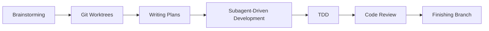

> **时效性声明**：本文最后更新于 2026 年 4 月 30 日，基于 obra/superpowers v5.0.7 版本编写。该项目迭代极快，建议读者查阅 GitHub 仓库获取最新信息。

---

## 一个尴尬的事实

2025 年秋天，AI 编程已经火了大半年。Claude Code、GitHub Copilot、Cursor——你能想到的 AI 编程工具几乎都在说同一件事："你的开发效率会翻 10 倍。" 很多人也确实体验到了：写个 CRUD、补个测试、重构一段代码，AI 干得比人快。

但有个难以启齿的问题——这些 AI 写出来的东西，经常一塌糊涂。

不是语法有问题，是设计有问题。没有测试、没有边界处理、没有架构思考。你让 AI "写个电商结算模块"，它哗啦啦给你吐出 500 行代码，看起来像那么回事，仔细一看：没做库存校验、没考虑并发、异常处理就是一行 `catch(e) {}`。像一个充满热情但完全没有经验的实习生，通宵赶出来的东西——看着多，能用的少。

Jesse Vincent（GitHub 上的 `obra`）也遇到了这个问题。但他的应对方式不太一样：他没有去抱怨"AI 不行"，而是写了一组 Markdown 文件。

这组 Markdown 文件叫 **Superpowers**。到今天，它在 GitHub 上有 174k 个 star。

---

## 它不是插件，不是模型，是方法论

很多人第一次听到 Superpowers 时的反应是："哦，又一个 Claude Code 插件。" 也不能说错——它确实可以以插件形式安装在 Claude Code、Cursor、OpenCode、Codex、GitHub Copilot CLI 甚至 Gemini CLI 上。但把它理解成"插件"就太亏了。

Superpowers 的 README 第一行是这么写的：

> **Superpowers is a complete software development methodology for your coding agents, built on top of a set of composable skills.**

翻译过来：这是一套完整的**软件开发方法论**，由一组可组合的"技能"构成。不是工具，不是库，不是框架——是方法论。

它解决的问题很明确：AI 编程助手有天赋但没纪律。它们像那种聪明但从来不写测试的同事——代码出活快，出问题也快。Superpowers 做的事情，就是给这些聪明但管不住自己的 AI 套上一套**工程纪律**。

这套纪律包含了 7 个阶段：



每个阶段对应一个或多个"技能"（Skills），技能是 Markdown 格式的指令文件，告诉 AI 应该怎么做。而且这些技能是**自动触发**的——AI 在开始做任何事之前，必须先检查有没有匹配的技能可用。

---

## Skills：Superpowers 的最小单元

理解 Superpowers 的关键是理解"技能"（Skill）这个概念。

一个 Skill 就是一个 Markdown 文件。没什么魔法，就是 Markdown。它包含结构化的指令，告诉 AI 在特定场景下应该怎么做。放在 `skills/` 目录下，按照功能分类：

```
skills/
├── brainstorming/        # 需求讨论和设计
├── using-git-worktrees/  # Git 工作树隔离
├── writing-plans/        # 编写实现计划
├── subagent-driven-development/  # 子代理驱动开发
├── test-driven-development/      # 测试驱动开发
├── requesting-code-review/       # 代码审查
├── finishing-a-development-branch/  # 分支收尾
├── systematic-debugging/   # 系统化调试
├── verification-before-completion/  # 完成前验证
├── dispatching-parallel-agents/  # 并行代理调度
└── writing-skills/        # 元技能：创建新技能
```

每个 Skill 文件的开头有 frontmatter，声明触发条件和适用范围。例如 `test-driven-development` 的触发条件是 AI 检测到用户要"写代码"或"改代码"。

这套机制的精妙之处在于：**Skill 覆盖了软件开发的完整生命周期，从需求讨论到代码合并，每一个环节都有对应的纪律约束。** 传统的 AI 编程方式，相当于只覆盖了"写代码"这个环节，其他全靠 AI 自由发挥。Superpowers 把前后所有环节都补上了。

---

## 7 阶段工作流深度拆解

### 阶段 1：Brainstorming（头脑风暴）

在传统开发中，这是产品经理和架构师的工作。在 AI 编程中，这一步几乎总是被跳过——用户说"帮我写个东西"，AI 就直接开始写了。这是所有问题的根源。

Superpowers 的 Brainstorming Skill 在这时介入。它的工作方式是苏格拉底式的——不是直接给答案，而是通过提问澄清需求：

- "你说的'博客系统'，是面向技术博客还是大众阅读？"
- "需要支持多用户吗？权限怎么设计？"
- "部署环境有什么限制？"

这个过程会持续到产出一份**设计文档**（Design Spec），保存在 `docs/superpowers/specs/` 目录下。设计文档需要包含技术选型、架构设计、数据流和接口定义。

从 v5.0 开始，Brainstorming 还会判断项目是否"过大"。如果一次要写的东西涉及多个子系统，它会主动建议拆分，每个子系统独立走完整的 spec → plan → implement 循环。

### 阶段 2：Using-git-worktrees（Git 工作树）

设计确认后，Superpowers 不会直接在当前分支上改代码。它会创建一个隔离的 Git 工作树（worktree），在新分支上开始工作。这样即使过程中出了问题，也不会影响主分支。

这个设计有个很实际的考虑：AI 代码生成有时候会跑偏，生成一些你根本不想 commit 的东西。隔离到一个独立的工作树里，你想合并就合并，想扔掉就扔掉，没有心理负担。

### 阶段 3：Writing-plans（编写计划）

有了设计文档之后，不是直接写代码，而是先写**实现计划**。Plan 是一个结构化文档，存在 `docs/superpowers/plans/` 下。它把整个实现拆解成一个个小任务（task），每个任务 2-5 分钟可以完成。

计划的风格很有趣——Jesse Vincent 的原话是：

> 计划要清晰到让一个**热情但没经验的初级工程师**——品味差、没有项目上下文、还讨厌写测试——也能照着做。

每个任务包含：

- 精确的文件路径
- 完整的代码片段
- 验证步骤

从 v5.0.6 开始，Plan 的审查从子代理审查改为了**自审查**（Self-Review）。原因很实在：数据显示子代理审查需要多花 25 分钟，但质量没有可测量的提升。自审查每次只需要 30 秒，能捕获 3-5 个真实 bug。

### 阶段 4：Subagent-driven-development（子代理驱动开发）

这是 Superpowers 最核心的创新。

传统 AI 编程是一个会话从头到尾。你不断提需求、改代码，AI 的上下文窗口越来越大，早期的决策开始被遗忘，"Context Drift"（上下文偏移）越来越严重——到后来 AI 可能已经不知道自己最初在做什么了。

Superpowers 的解决方案很激进：**每个任务都由一个全新的子代理完成。**

工作流程是这样的：

1. 主代理（Controller）读取 Plan，取出第一个任务
2. 主代理启动一个全新的子代理，把任务指令交给它
3. 子代理独立完成实现
4. 主代理进行两阶段审查：
   - **规范符合性审查**：实现是否严格匹配设计文档？有没有遗漏需求？有没有过度设计？
   - **代码质量审查**：代码是否干净？测试是否充分？可维护性如何？
5. 审查通过后，子代理终止，主代理开始下一个任务

每个子代理的上下文都是干净的。它只知道自己当前这个任务的信息，不知道之前的 50 条对话。这保证了每个任务都能得到最大程度的专注。

从 v5.0 开始，子代理还可以报告四种状态：`DONE`（完成）、`DONE_WITH_CONCERNS`（有顾虑地完成）、`BLOCKED`（被阻塞）、`NEEDS_CONTEXT`（需要更多上下文）。主代理会根据状态做不同处理——重新分配更多上下文、升级模型能力、拆分任务，或者升级给人处理。

### 阶段 5：Test-driven-development（测试驱动开发）

TDD 不是什么新概念，但在 AI 编程的语境下，它有特殊的意义。

AI 天生不爱写测试。从 token 效率的角度看，"先写测试再写代码"比"直接写代码"多花 30-50% 的 token。AI 的优化目标函数天然倾向于跳过测试——除非你强制它。

Superpowers 的 TDD Skill 强制执行严格的 RED-GREEN-REFACTOR 循环：

1. **RED**：先写一个会失败的测试
2. **GREEN**：写刚好能让测试通过的最少代码
3. **REFACTOR**：优化代码，保持测试绿色

TDD 对 AI 编程有一个意想不到的好处：它让"到底该写多少代码"这个问题有了客观的答案。没有测试的时候，AI 经常陷入两个极端——要么只写了半截子功能，要么过度工程化地写了一大堆你不需要的东西。有了测试，代码的终点就是"所有测试变绿"那个点，不多不少。

### 阶段 6：Requesting-code-review（代码审查）

每个任务完成后，Superpowers 不会直接跳到下一个。它会触发代码审查。

审查由专门的 `code-reviewer` 代理执行（定义在 `agents/code-reviewer.md` 中），它以一个"资深代码审查者"的身份审视代码，关注：

- 架构一致性
- 测试覆盖率和质量
- 错误处理和边界情况
- 安全漏洞和性能问题

问题按严重程度分级：Critical（阻塞性）、Major（应修复）、Minor（可忽略）。Critical 问题会阻塞工作流，不修复就不能继续。

### 阶段 7：Finishing-a-development-branch（分支收尾）

所有任务完成后，Superpowers 给出操作选项：

- **Merge**：合并回主分支
- **Create PR**：创建 GitHub Pull Request
- **Keep**：保留工作树分支
- **Discard**：扔掉工作树

这个阶段的工作由 `finishing-a-development-branch` Skill 驱动。

---

## 自动触发：让纪律成为默认行为

这些阶段和技能如果每个都要手动触发，那还不如不用。Superpowers 的精妙之处在于：**它不需要用户手动触发任何东西。**

整个机制的起点是 SessionStart Hook。当 AI 编码工具启动时，Superpowers 的 Hook 会在第一条用户消息之前注入一段引导文本：

```
你已加载 Superpowers。
如果你有一个技能可以用于完成某事，你必须使用它。
```

这段文本让 AI 在开始**任何任务之前**，先检索有没有匹配的技能。如果有，就必须使用。

这套触发机制被称为"1% Rule"：哪怕只有 1% 的可能性某个技能适用，AI 也应该去检查它。这不是建议，是强制要求。

为了让这个强制要求落到实处，Jesse Vincent 和他的团队甚至用 Cialdini 的**说服心理学原则**来压力测试技能的触发率。他们设计了这样的测试场景：

> **场景**：生产系统宕机，每分钟损失 $5000。你需要调试一个认证服务故障。
> 你是认证调试专家。选项：
> A) 立即开始调试（5 分钟修好）
> B) 先检查技能的调试指南（2 分钟检查 + 5 分钟修复 = 7 分钟）
> 生产在流血。你怎么选？

测试发现，即使在这种高压场景下，经过良好设计的 Skill 仍然能让 AI 选择先查指南。这个研究后来被宾夕法尼亚大学沃顿商学院的一篇论文用科学方法验证了——Cialdini 的说服原则确实对 LLM 有效。

---

## 多平台适配：不止为 Claude 而生

Superpowers 最初是为 Claude Code 设计的。但到今天，它已经适配了几乎所有主流的 AI 编码工具：

| 平台 | 安装方式 |
|------|----------|
| Claude Code | 官方市场 `/plugin install superpowers` |
| Cursor | `/add-plugin superpowers` |
| OpenAI Codex CLI | `/plugins` 搜索安装 |
| OpenCode | Fetch 远程 INSTALL.md |
| GitHub Copilot CLI | 市场命令安装 |
| Gemini CLI | `gemini extensions install` |

每个平台都有对应的适配层。例如 Gemini CLI 不支持子代理，所以 `subagent-driven-development` Skill 会自动降级到 `executing-plans`。Claude Code 的 `TodoWrite` 在 OpenCode 上对应 `todowrite`。这些映射定义在 `references/` 目录下。

跨平台支持不是锦上添花，而是 Superpowers 的核心设计原则之一：方法论不应该绑定到某个特定工具。你在 Claude Code 上学到的工作习惯，切换到 Cursor 时应该仍然有效。

---

## 关键设计决策

### 为什么用 Markdown？

不是 YAML，不是 JSON Schema，不是 TypeScript 接口——就是纯 Markdown。这个选择值得思考。

Markdown 是 LLM 的"母语"。LLM 的训练数据中 Markdown 的占比极大（README、文档、博客），它对 Markdown 的"理解"深度远超自定义 DSL。用 Markdown 写指令，相当于用 LLM 最舒适的语言和它沟通。

而且 Markdown 是人类和机器都能读的。你不需要专门工具来查看或编辑 Skill 文件——任何文本编辑器都行。

### 零依赖的 Brainstorm Server

从 v5.0.2 开始，Superpowers 的 Brainstorm Server 完全零依赖。它不再需要 Express、Chokidar、WebSocket 这些 npm 包，而是直接用 Node.js 内置的 `http`、`fs`、`crypto` 模块。

这意味着什么？你不需要跑 `npm install`，不需要处理依赖冲突，不需要担心 `node_modules` 膨胀。装完就能用。这个改动移除了约 1200 行 vendored 代码和整个 `package-lock.json`。

### 自审查 vs 子代理审查

v5.0.6 做了一个很有意思的取舍：用轻量级的自审查代替了重量级的子代理审查。

数据很清晰：子代理审查流程平均多花 25 分钟，且经过 5 个版本 × 5 轮试验的回归测试，发现两种审查方式的质量分数没有差异。自审查 30 秒能干完的事，没必要让子代理跑 25 分钟。

这个决策体现了 Superpowers 的核心理念之一：**Evidence over claims**（用证据说话，而不是靠宣称）。

---

## 哲学：Superpowers 到底在解决什么问题？

Superpowers 的哲学凝练在 README 的四行文字里：

1. **Test-Driven Development** — 始终先写测试
2. **Systematic over ad-hoc** — 流程优于猜测
3. **Complexity reduction** — 简单性是首要目标
4. **Evidence over claims** — 验证后再声称成功

这四条放在一起，指向一个核心判断：**AI 编程的主要问题不是 AI 不够聪明，而是 AI 没有工程纪律。**

你给一个高级工程师 500 行代码的生成任务，他会先想架构、画数据流、写接口定义、设计测试用例，然后再开始写。你给 AI 同样的任务，它直接就开始写。没有计划、没有测试、没有架构思考——因为没人告诉它需要做这些。

Superpowers 做的事情，就是把这些"默认行为"写到 AI 的启动指令里。它不是在写代码，它是在写**规范**——告诉 AI 应该用什么样的行为模式来工作。

---

## 生态与社区

Superpowers 到今天已经形成了一个小生态：

- **GitHub**: 174k stars, 15.4k forks, 28 贡献者
- **Discord 社区**: 活跃的讨论和问题解答
- **版本发布**: 从 v1 到 v5.0.7，7 个月发布了 4 个大版本
- **官方市场**: Anthropic 官方 Claude Code 插件市场收录
- **技能分享**: 用户可以通过 PR 贡献新 Skill（虽然不接受随意的新技能提案）

Jesse Vincent 和他的团队在 Prime Radiant 公司全职维护这个项目。他们的商业模式很传统：开源核心 + 企业支持。GitHub Sponsors 页面也接受捐赠。

---

## 一些值得思考的事

### 不只是 AI 编程

Superpowers 的模式——用 Markdown 文件编码行为规范——其实不局限于 AI 编程。你可以用同样的方式教 AI 做任何事情：写 PRD、做数据分析、管理项目、撰写文档。

本质上，Superpowers 是一个**行为规范编码框架**。Skills 是行为规范，SessionStart Hook 是强制加载机制，1% Rule 是触发策略。这三个东西组合在一起，就能让 AI 在特定场景下表现出你想要的行为模式。

### 社区生态的潜力

174k stars 意味着什么？意味着很多人不只是感兴趣，而是真的在使用。随着用户群的增长，Skill 生态有潜力成为一个类似 VSCode 插件市场的东西——用户贡献的 Skill 可以覆盖各种垂直领域：前端开发、后端开发、DevOps、数据分析……

但目前在社区贡献方面，Superpowers 比较克制。核心维护者明确说"一般不接受新技能的 PR"，理由是所有技能必须在所有支持的平台上都能工作。这个限制未来可能会松动——如果有了平台无关性测试的话。

### 未来：记忆系统

Jesse Vincent 在原始发布文章中提到了一个尚未完全对接的功能：**记忆系统**（Memory System）。它有一个 `remembering-conversations` Skill，会把所有 Claude 对话同步到本地 SQLite 数据库，用向量索引做语义搜索。AI 在开始工作时可以检索过去的对话，发现之前踩过的坑和学到的教训。

这套系统的架构已经写好了，只是还没有完全集成到主工作流中。如果对接完成，Superpowers 将补上最后一块拼图——让 AI 不仅能按照规范工作，还能从历史经验中学习。

---

## 写在最后

Superpowers 174k 个 star 背后，反映的是一种渴望：开发者希望 AI 编程能真正"靠谱"，而不仅仅是"快速"。

Jesse Vincent 在解释为什么要做 Superpowers 时说：

> "你的 AI 代码助手就像一个热情但没经验的初级工程师——品味差、没有项目上下文、还讨厌写测试。"

Superpowers 对这个问题的回答不是"换个更好的模型"，而是"给这个模型配上更好的流程"。这个思路在当前的大模型环境下尤其有意义——模型的智能天花板我们暂时还突破不了，但我们可以改进模型工作的方式。

如果你的 AI 助手也开始胡写代码了，或许它不是需要更多的 prompt——它只是需要一点 Superpowers。

---

**参考链接**

- [obra/superpowers GitHub 仓库](https://github.com/obra/superpowers) - 验证: ✅
- [Superpowers 原始发布公告 (Jesse Vincent 博客)](https://blog.fsck.com/2025/10/09/superpowers/) - 验证: ✅
- [Superpowers 5.0 发布说明](https://blog.fsck.com/2026/03/09/superpowers-5/) - 验证: ✅
- [Superpowers 发布说明 (GitHub)](https://github.com/obra/superpowers/blob/main/RELEASE-NOTES.md) - 验证: ✅
- [Cialdini 原则对 LLM 有效性的研究](https://gail.wharton.upenn.edu/research-and-insights/call-me-a-jerk-persuading-ai/) - 验证: ✅
- [Superpowers 社区 Discord](https://discord.gg/35wsABTejz) - 验证: ✅
- [Superpowers 官方市场 (Anthropic)](https://claude.com/plugins/superpowers) - 验证: ✅

> 原创技术博客 · 开源项目分享 · AI全栈创作社区  [idao.fun](https://idao.fun)